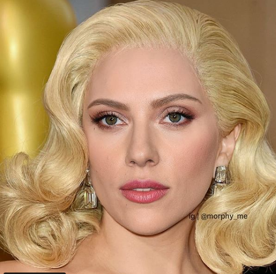
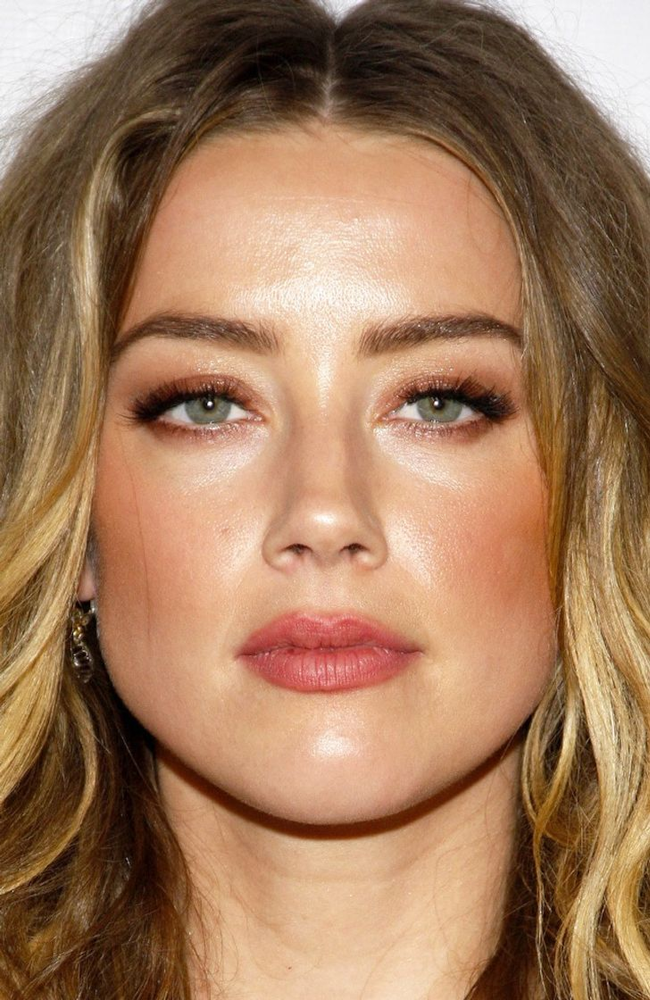
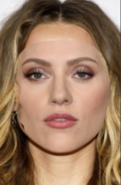
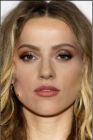

# Face swapping with Delaunay triangulation and poisson blending

A simple project showing how to do face swapping between 2 images using OpenCV and face landmarks.

## How does it work ?

The idea is to transform the source face to match the destination face to swap to by using corresponding triangular
meshes to transform the source face positioning to the destination face and then copy-and-paste the transformed source
face over the destination face.

The overall performance of this method depends on the face landmarks model chosen. Increasing the number of landmarks N
can increase the transformation accuracy but also increase the computation time whose complexity is O(N) since each
triangle needs to be transformed (non-negligible cost depending on the size of the inputs).

This method can leave artifacts on the final output image.

Source face       |  Destination face | Copy-paste transformed source to destination face without poisson blending | Copy-paste transformed source to destination face with poisson blending
:-------------------------:|:-------------------------:|:-------------------------:|:-------------------------:
  |   |  | 

### 1. Delaunay triangulation and affine transformation

- Calculate the triangular meshes of the 2 face images to swap by using their face landmarks.
- Then map each triangle from the source face to its corresponding triangle for the destination face.
- Use affine transformation to transform each triangle from the source face to its corresponding triangle

Good illustrations can be found at https://github.com/Azmarie/Face-Morphing. (thank you Azmarie)

### 2. Poisson blending

Check out this great explanation of poisson blending usage for seamless copy-and-paste of
images : https://erkaman.github.io/posts/poisson_blending.html

The idea is to copy the transformed source face and seamlessly copy-and-paste it over the position of the destination
face image.

## Prerequisites

Developed with python 3.7. Not tested with another python version.

### 1. Install a face landmarks library

You can install any well-known face landmarks library, prefer 2D face landmarks models. 3D landmarks can work but there
might be artifacts.

2D landmarks model :

- dlib : https://github.com/davisking/dlib

for dlib face landmarks models, 2 models need to be downloaded at https://github.com/davisking/dlib-models
_shape_predictor_68_face_landmarks.dat_ and _mmod_human_face_detector.dat_. Then, move them to [models](models/).

3D landmarks model:

- Mediapipe : https://github.com/google/mediapipe

### 2. Install other dependencies

    pip install -r requirements.txt

## Try the code, face swap between 2 images

By default, use mediapipe face landmarks model :

    python face_swap.py --src_face images/image_2.jpg --dest_face images/image_1.jpg --output images/swap_2_1.jpg

Use dlib :

    python face_swap.py --src_face images/image_2.jpg --dest_face images/image_1.jpg --output images/swap_2_1.jpg --landmarks dlib

## Related work

Other and more recent techniques exist for the face swapping problem, especially, ones using deep learning. They have
the advantage of better visual and color conservation.

Some popular repositories using deep learning for face swapping :

- https://github.com/deepfakes/faceswap
- https://github.com/iperov/DeepFaceLab

## Improvement suggestions

- Dockerize installation
- In-depth performance comparison with deep learning models
- Real-time performance

## License

This project is licensed under the MIT License - see the [LICENSE.md](LICENSE.md) file for details
